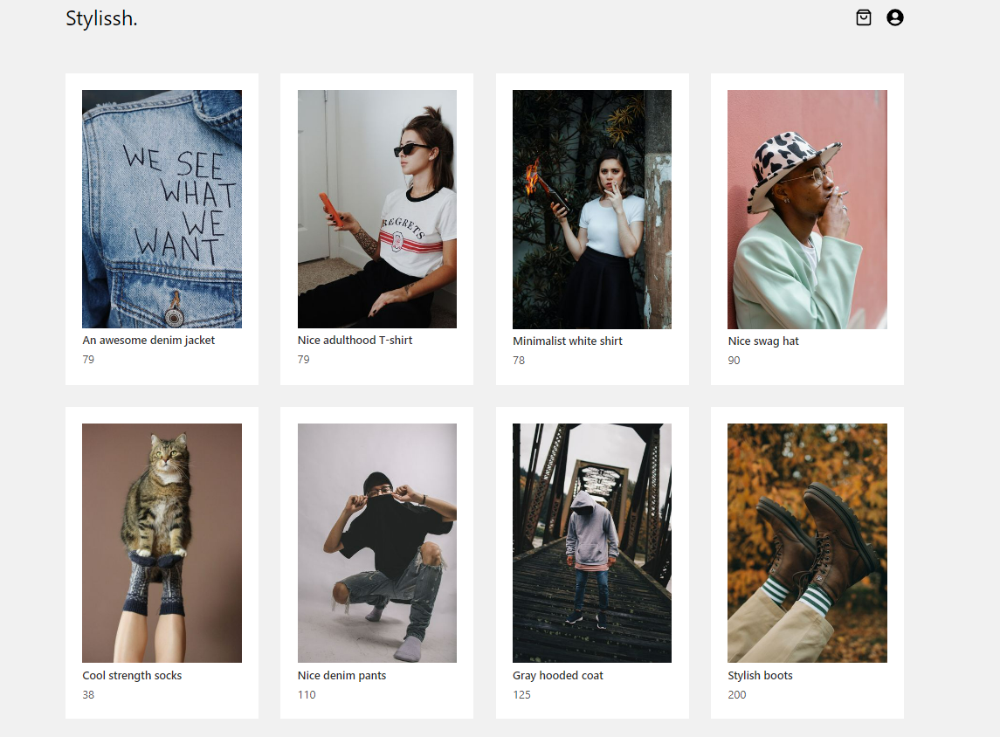
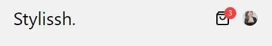
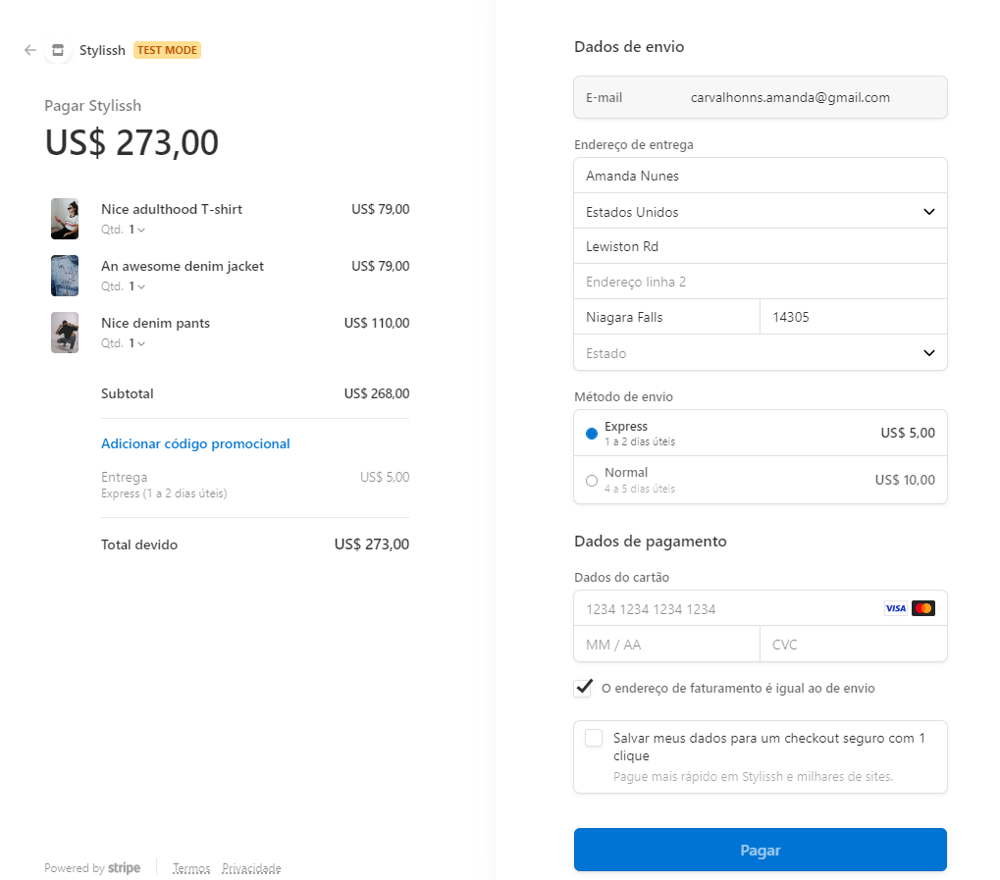
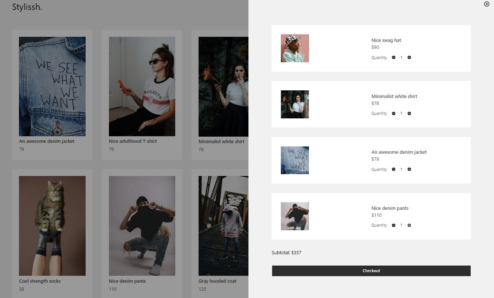
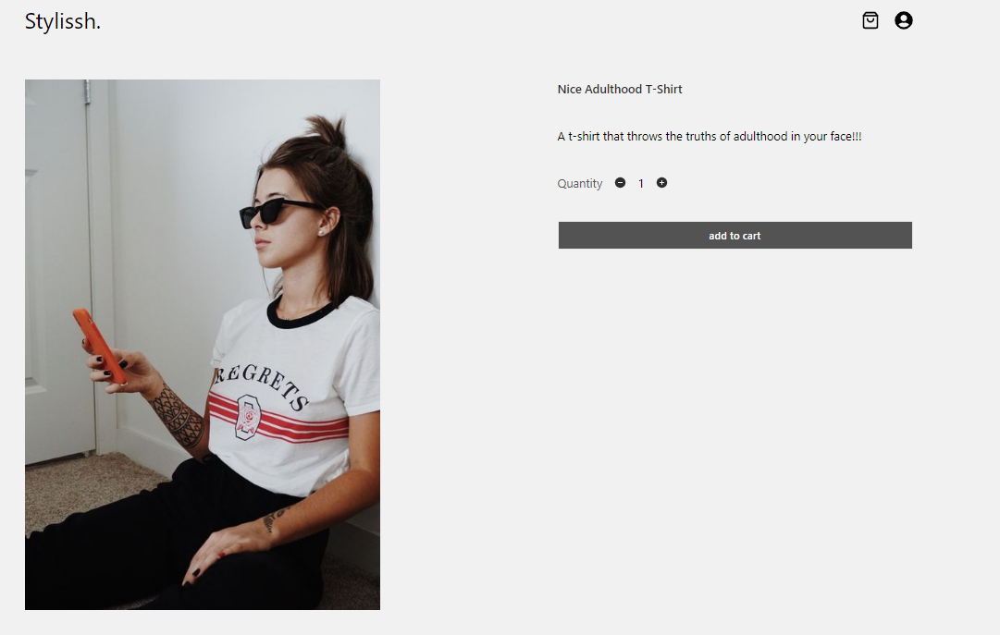
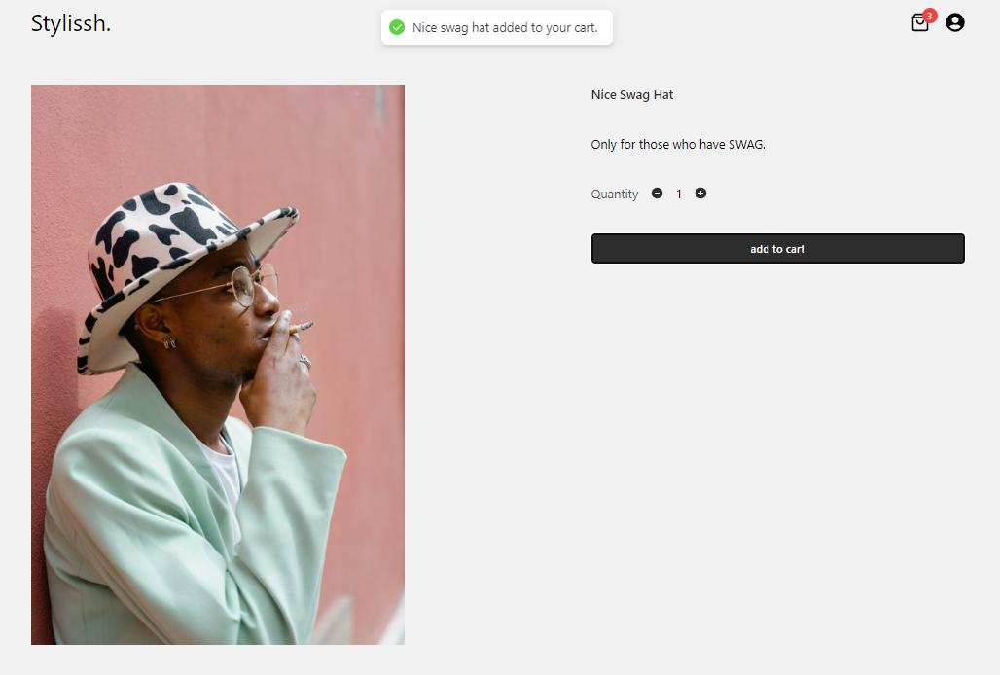
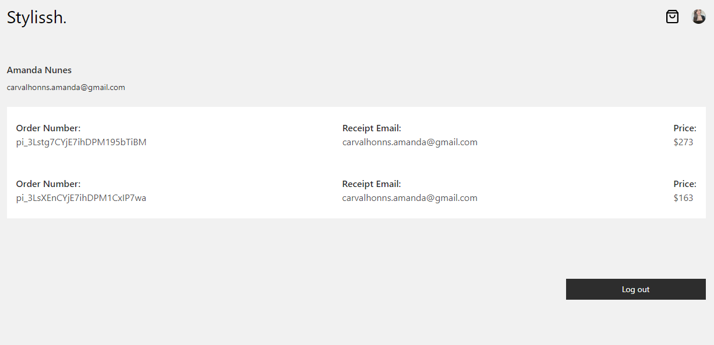
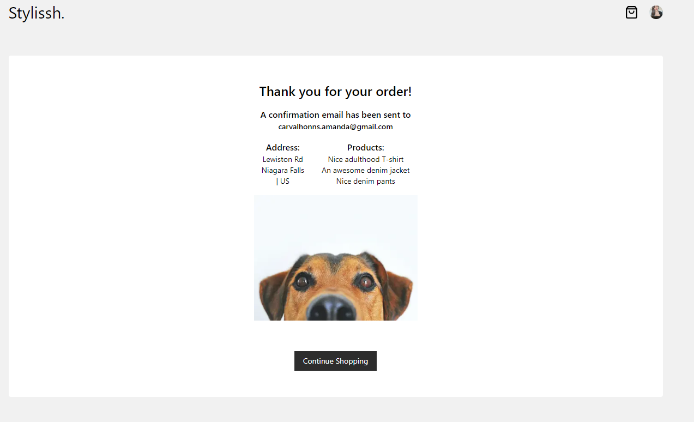

# Stylishh.

E-commerce project created during **_The Full Stack React Course_** by developedbyed | Creative Programming and Design Courses.

 

## About

Full Stack e-commerce application with the following features:

- User Authentication - including Google Signin:  
  

- Secure Payments - including Apple and Google Pay - and email invoicing with Stripe:
  

- Interactive product page and shopping cart:
  
  

- Toast messages when add products to cart:
  

- See an order history page - if logged in with auth:
  

- Customized success checkout page:
  

## Techs and Tools

### Back End 🛠️

- Strapi
- GraphQL
- Auth0 for authentication
- Stripe for payment, invoicing, etc
- Cloudinary

* [Backend project available in this repository](https://github.com/mandyHellz/stylissh-backend)

### Front End 👩‍💻

- Next.js
- React
- Typescript
- URql for fetching data
- Tailwind for styling
- Framer Motion for animation
- React Hot Toast for pop up notifications
